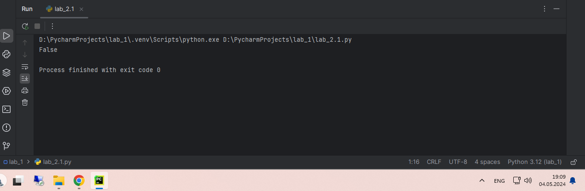
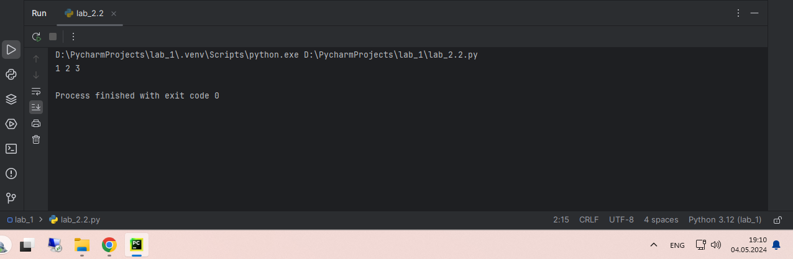
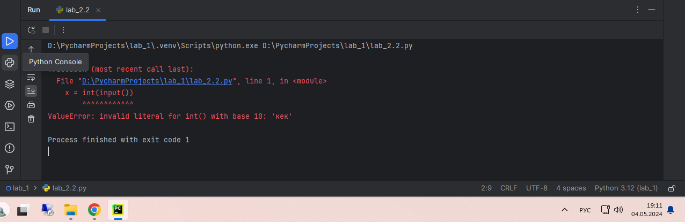
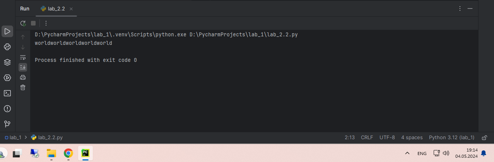
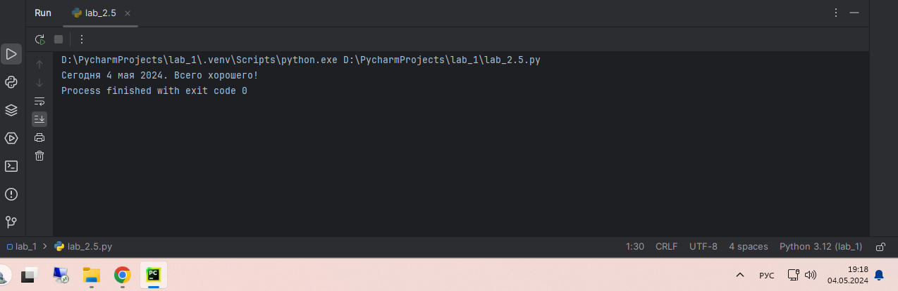
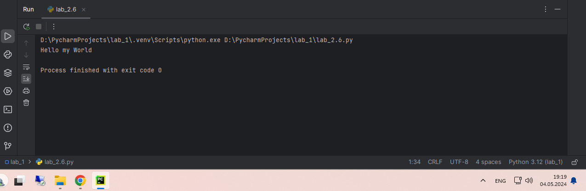
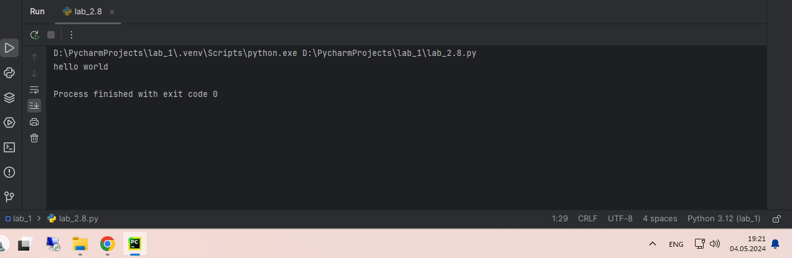
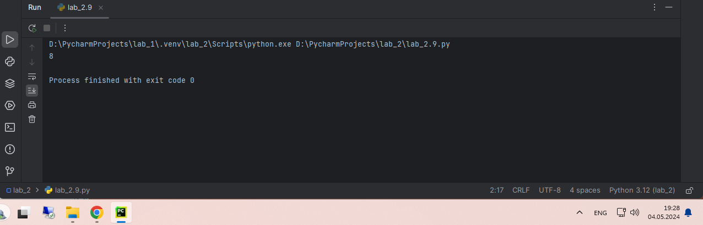
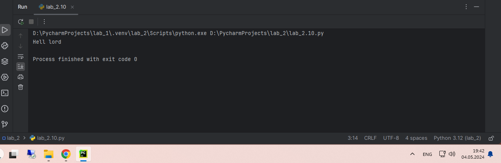

# Тема 2. Базовые операции языка Python
Отчет по Теме #2 выполнил:
- Каленюк Дмитрий Валерьевич
- ИНО ОЗБ ПОАС-22-2

| Задание    | Сам_раб |
|------------|---------|
| Задание 1  | +       |
| Задание 2  | +       |
| Задание 3  | +       |
| Задание 4  | +       |
| Задание 5  | +       |
| Задание 6  | +       |
| Задание 7  | +       |
| Задание 8  | +       |
| Задание 9  | +       |
| Задание 10 | +       |


знак "+" - задание выполнено; знак "-" - задание не выполнено;

Работу проверили:
- к.э.н., доцент Панов М.А.

## Самостоятельная работа №1
### Выведите в консоль булевую переменную False, не используя слово False в строке или изначально присвоенную булевую переменную. Программа должна занимать не более двух строк редактора кода.

```python
print(not True)
```
### Результат


## Самостоятельная работа №2
### Присвоить значения трем переменным и вывести их в консоль, используя только две строки редактора кода.

```python
a, b, c = 1, 2, 3
print(a, b, c)
```
### Результат


## Самостоятельная работа №3
### Реализуйте ввод данных в программу, через консоль, в виде только целых чисел (тип данных int). То есть при вводе буквенных символов в консоль, программа не должна работать. Программа должна занимать не более двух строк редактора кода.

```python
x = int(input())
print(x)
```
### Результат


## Самостоятельная работа №4
### Создайте только одну строковую переменную. Длина строки должна не превышать 5 символов. На выходе мы должны получить строку длиной не менее 16 символов. Программа должна занимать не более двух строк редактора кода.

```python
s = 'world'
print(s * 5)
```
### Результат


## Самостоятельная работа №5
### Создайте три переменные: день (тип данных - числовой), месяц (тип данных - строка), год (тип данных - числовой) и выведите в консоль текущую дату в формате: “Сегодня день месяц год. Всего хорошего!” используя F строку и оператор end внутри print(), в котором вы должны написать фразу “Всего хорошего!”. Программа должна занимать не более двух строк редактора кода.

```python
day, month, year =4, 'мая', 2024
print(f"Сегодня {day} {month} {year}.", end=" Всего хорошего!")
```
### Результат


## Самостоятельная работа №6
### В предложении ‘Hello World’ вставьте ‘my’ между двумя словами. Выведите полученное предложение в консоль в одну строку. Программа должна занимать не более двух строк редактора кода.

```python
print('Hello' + ' my ' + 'World')
```
### Результат


## Самостоятельная работа №7
### Узнайте длину предложения ‘Hello World’, результат выведите в консоль. Программа должна занимать не более двух строк редактора кода.

```python
print(len('Hello World'))
```
### Результат


## Выводы
Пример демонстрирует использование функции len(), которая позволяет определить количество символов в строке. Это базовая и важная функция в программировании для работы со строками.

## Самостоятельная работа №8
### Переведите предложение ‘HELLO WORLD’ в нижний регистр. Программа должна занимать не более двух строк редактора кода.

```python
print('HELLO WORLD'.lower())
```
### Результат


## Самостоятельная работа №9
### Самостоятельно придумайте задачу по проходимой теме и решите ее. Задача должна быть связанна со взаимодействием с числовыми значениями.
### Вычислить сумму чисел и результат вывести в консоль.

```python
a, b, c = 5, 3, 1
print(a + c * b)
```
### Результат


## Самостоятельная работа №10
### Самостоятельно придумайте задачу по проходимой теме и решите ее. Задача должна быть связанна со взаимодействием со строковыми значениями.
### Создайте фразу, из фразы "Hello World" и выведите ее в консоль.

```python
sentence = 'Hello World'
result = sentence[:4] + " " + sentence[9] + sentence[7] + sentence[8] + sentence[10]
print(result)
```
### Результат

