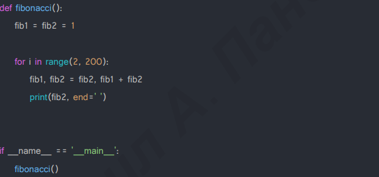
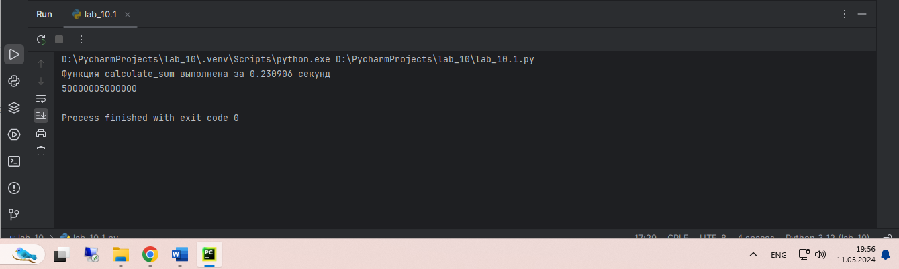
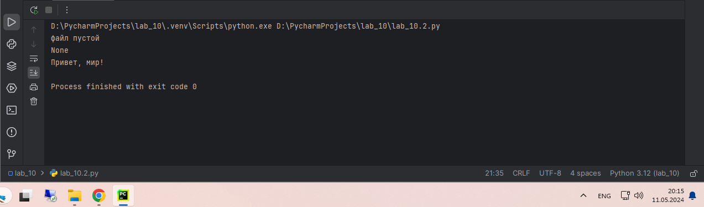
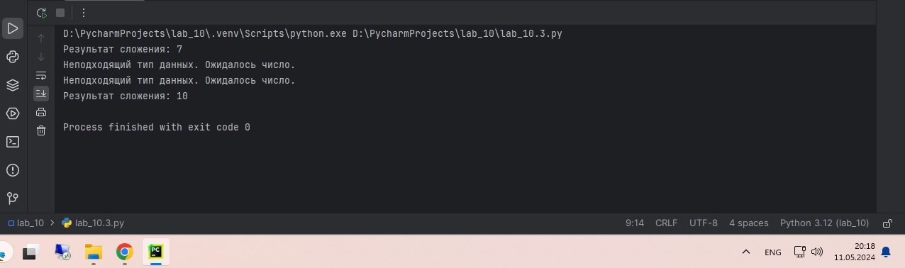
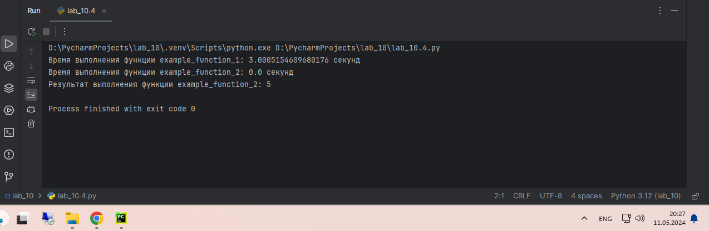
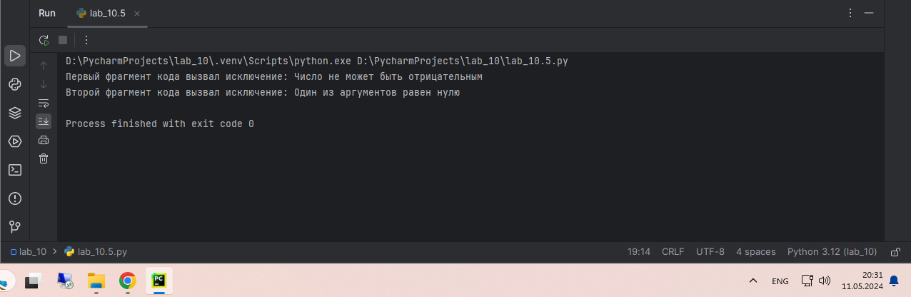

# Тема 10. Декораторы и исключения
Отчет по Теме #10 выполнил:
- Каленюк Дмитрий Валерьевич
- ИНО ОЗБ ПОАС-22-2

| Задание   | Сам_раб |
|-----------|---------|
| Задание 1 | +       |
| Задание 2 | +       |
| Задание 3 | +       |
| Задание 4 | +       |
| Задание 5 | +       |

знак "+" - задание выполнено; знак "-" - задание не выполнено;

Работу проверили:
- к.э.н., доцент Панов М.А.

## Самостоятельная работа 1
### Вовочка решил заняться спортивным программированием на python, но для этого он должен знать за какое время выполняется его программа. Он решил, что для этого ему идеально подойдет декоратор для функции, который будет выяснять за какое время выполняется та или иная функция. Помогите Вовочке в его начинаниях и напишите такой декоратор. Подсказка: необходимо использовать модуль time Декоратор необходимо использовать для этой функции:

### Результатом вашей работы будет листинг кода и скриншот консоли, в котором будет выполненная функция Фибоначчи и время выполнения программы. Также на этом примере можете посмотреть, что решение задач через рекурсию не всегда является хорошей идеей. Поскольку решение Фибоначчи для 100 с использованием рекурсии и без динамического программирования решается более десяти секунд, а решение точно такой же задачи, но через цикл for еще и для 200, занимает меньше 1 секунды.

```python
import time

def timing_decorator(func):
    def wrapper(*args, **kwargs):
        start_time = time.perf_counter()
        result = func(*args, **kwargs)
        end_time = time.perf_counter()
        elapsed_time = end_time - start_time
        print(f"Функция {func.__name__} выполнена за {elapsed_time:.6f} секунд")
        return result
    return wrapper

@timing_decorator
def calculate_sum(n):
    return sum(range(1, n + 1))

print(calculate_sum(10000000))
```
### Результат


## Самостоятельная работа 2
### Посмотрев на Вовочку, вы также загорелись идеей спортивного программирования, начав тренировки вы узнали, что для решения некоторых задач необходимо считывать данные из файлов. Но через некоторое время вы столкнулись с проблемой что файлы бывают пустыми, и вы не получаете вводные данные для решения задачи. После этого вы решили не просто считывать данные из файла, а всю конструкцию оборачивать в исключения, чтобы избежать такой проблемы. Создайте пустой файл и файл, в котором есть какая-то информация. Напишите код программы. Если файл пустой, то, нужно вызвать исключение (“бросить исключение”) и вывести в консоль “файл пустой”, а если он не пустой, то вывести информацию из файла.

```python
def read_file_content(filename):
    try:
        with open(filename, 'r') as file:
            content = file.read().strip()
            if not content:
                raise ValueError("файл пустой")
            return content
    except FileNotFoundError:
        print(f"Файл {filename} не найден.")
    except ValueError as e:
        print(e)

with open('empty.txt', 'w') as file:
    pass

with open('non_empty.txt', 'w') as file:
    file.write("Привет, мир!")

print(read_file_content('empty.txt'))

print(read_file_content('non_empty.txt'))
```
### Результат


## Самостоятельная работа 3
### Напишите функцию, которая будет складывать 2 и введенное пользователем число, но если пользователь введет строку или другой неподходящий тип данных, то в консоль выведется ошибка “Неподходящий тип данных. Ожидалось число.”. Реализовать функционал программы необходимо через try/except и подобрать правильный тип исключения. Создавать собственное исключение нельзя. Проведите несколько тестов, в которых исключение вызывается и нет. Результатом выполнения задачи будет листинг кода и получившийся вывод в консоль

```python
def add_two(user_input):
    try:
        result = 2 + int(user_input)
        print(f"Результат сложения: {result}")
    except ValueError:
        print("Неподходящий тип данных. Ожидалось число.")

add_two("5")
add_two("4.23")
add_two("abc")
add_two("8")
```
### Результат


## Самостоятельная работа 4
### Создайте собственный декоратор, который будет использоваться для двух любых вами придуманных функций. Декораторы, которые использовались ранее в работе нельзя воссоздавать. Результатом выполнения задачи будет: класс декоратора, две как-то связанными с ним функциями, скриншот консоли с выполненной программой и подробные комментарии, которые будут описывать работу вашего кода.

```python
class TimerDecorator:
    def __init__(self, func):
        self.func = func

    def __call__(self, *args, **kwargs):
        start_time = time.time()
        result = self.func(*args, **kwargs)
        end_time = time.time()
        execution_time = end_time - start_time
        print(f"Время выполнения функции {self.func.__name__}: {execution_time} секунд")
        return result

@TimerDecorator
def example_function_1(n):
    # Просто заснем на n секунд
    time.sleep(n)

@TimerDecorator
def example_function_2(a, b):
    # Просто сложим два числа
    return a + b

example_function_1(3)
result = example_function_2(2, 3)
print("Результат выполнения функции example_function_2:", result)
```
### Результат


## Самостоятельная работа 5
### Создайте собственное исключение, которое будет использоваться в двух любых фрагментах кода. Исключения, которые использовались ранее в работе нельзя воссоздавать. Результатом выполнения задачи будет: класс исключения, код к котором в двух местах используется это исключение, скриншот консоли с выполненной программой и подробные комментарии, которые будут описывать работу вашего кода.

```python
class CustomException(Exception):
    def __init__(self, message="Это собственное исключение"):
        self.message = message
        super().__init__(self.message)

def function_with_exception(x):
    if x < 0:
        raise CustomException("Число не может быть отрицательным")
try:
    function_with_exception(-1)
except CustomException as e:
    print("Первый фрагмент кода вызвал исключение:", e)

def another_function(x, y):
    if x == 0 or y == 0:
        raise CustomException("Один из аргументов равен нулю")

try:
    another_function(0, 5)
except CustomException as e:
    print("Второй фрагмент кода вызвал исключение:", e)
```
### Результат

