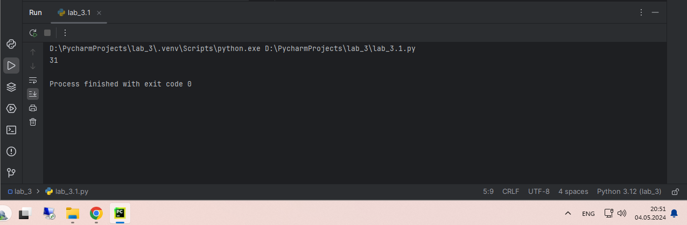
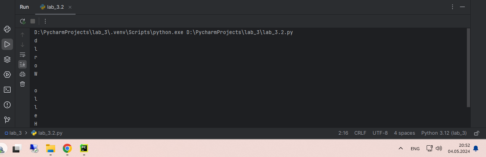
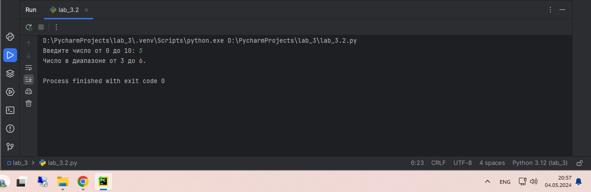
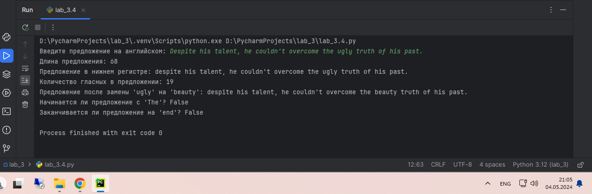
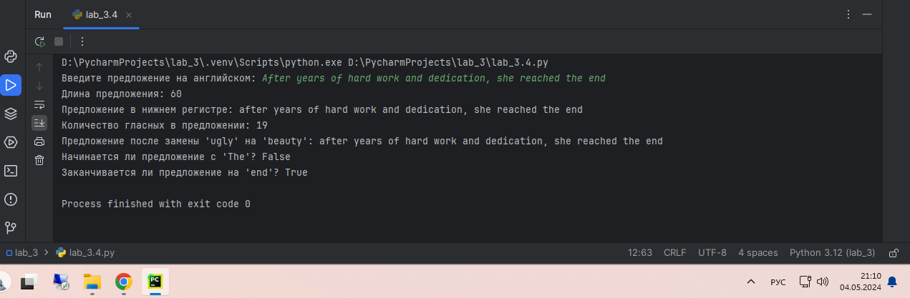
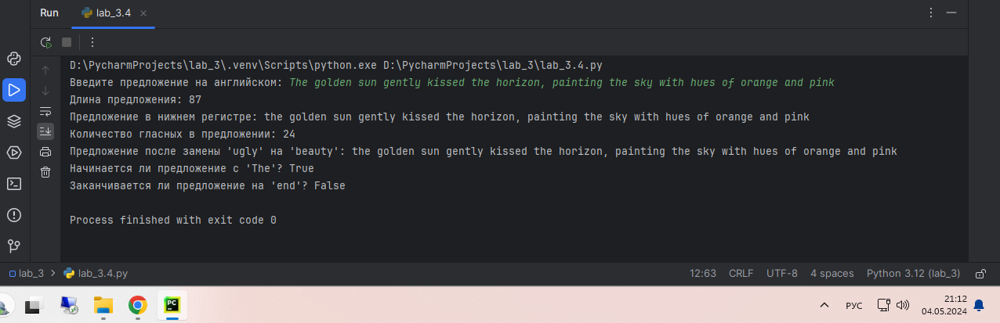
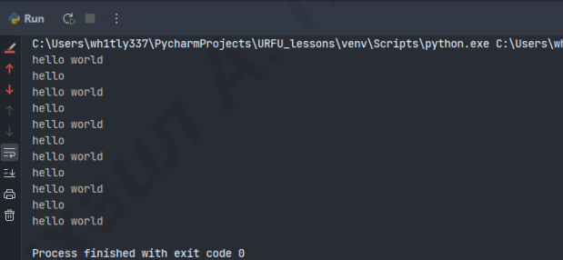
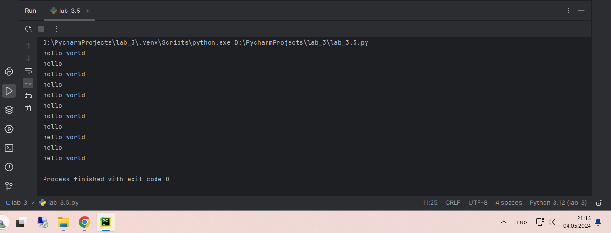

# Тема 3. Операторы, условия, циклы
Отчет по Теме #3 выполнил:
- Каленюк Дмитрий Валерьевич
- ИНО ОЗБ ПОАС-22-2

| Задание    | Сам_раб |
|------------|---------|
| Задание 1  | +       |
| Задание 2  | +       |
| Задание 3  | +       |
| Задание 4  | +       |
| Задание 5  | +       |

знак "+" - задание выполнено; знак "-" - задание не выполнено;

Работу проверили:
- к.э.н., доцент Панов М.А.

## Самостоятельная работа №1
### Напишите программу, которая преобразует 1 в 31. Для выполнения поставленной задачи необходимо обязательно и только один раз использовать:
* Цикл for
* *= 5
* += 1
### Никаких других действий или циклов использовать нельзя.

```python
x = 1
for _ in range(2):
    x *= 5
    x += 1
print(x)
```
### Результат


## Самостоятельная работа №2
### Напишите программу, которая фразу «Hello World» выводит в обратном порядке, и каждая буква находится в одной строке консоли. Пример вывода в консоль:

### При этом необходимо обязательно использовать любой цикл, а также программа должна занимать не более 3 строк в редакторе кода.

```python
for char in "Hello World"[::-1]:
    print(char)
```
### Результат


## Самостоятельная работа №3
### Напишите программу, на вход которой поступает значение из консоли, оно должно быть числовым и в диапазоне от 0 до 10 включительно (это необходимо учесть в программе). Если вводимое число не подходит по требованиям, то необходимо вывести оповещение об этом в консоль и остановить программу. Код должен вычислять в каком диапазоненаходится полученное число. Нужно учитывать три диапазона:
* от 0 до 3 включительно
* от 3 до 6
* от 6 до 10 включительно
### Результатом работы программы будет выведенный в консоль диапазон. Программа должна занимать не более 10 строчек в редакторе кода.

```python
try:
    number = float(input("Введите число от 0 до 10: "))
    if not 0 <= number <= 10: print("Число должно быть в диапазоне от 0 до 10.")
    elif number <= 3: print("Число в диапазоне от 0 до 3 включительно.")
    elif number <= 6: print("Число в диапазоне от 3 до 6.")
    else: print("Число находится в диапазоне от 6 до 10 включительно.")
except ValueError:
    print("Необходимо ввести число.")
```
### Результат


## Самостоятельная работа №4
### Манипулирование строками. Напишите программу на Python, которая принимает предложение (на английском) в качестве входных данных от пользователя. Выполните следующие операции и отобразите результаты:
* Выведите длину предложения.
* Переведите предложение в нижний регистр.
* Подсчитайте количество гласных (a, e, i, o, u) в предложении.
* Замените все слова "ugly" на "beauty".
* Проверьте, начинается ли предложение с "The" и заканчивается
ли на "end"
### Проверьте работу программы минимум на 3 предложениях, чтобы охватить проверку всех поставленных условий.

```python
sentence = input("Введите предложение на английском: ")
print("Длина предложения:", len(sentence))
lower_sentence = sentence.lower()
print("Предложение в нижнем регистре:", lower_sentence)
vowels_count = sum(1 for char in lower_sentence if char in 'aeiou')
print("Количество гласных в предложении:", vowels_count)
beautified_sentence = lower_sentence.replace("ugly", "beauty")
print("Предложение после замены 'ugly' на 'beauty':", beautified_sentence)
starts_with_the = sentence.startswith("The")
ends_with_end = sentence.endswith("end")
print("Начинается ли предложение с 'The'?", starts_with_the)
print("Заканчивается ли предложение на 'end'?", ends_with_end)
```
### Результат





## Самостоятельная работа №5
### Составьте программу, результатом которой будет данный вывод в консоль:

### Программу нужно составить из данных фрагментов кода:

### Строки кода можно использовать только один раз. Не обязательно использовать все строки кода.

```python
string = 'hello'
values = [0, 2, 4, 6, 8, 10]
counter = 0
while counter != 10:
    if counter in values:
        memory = ' world'
    else:
        memory = ''
    print(string + memory)
    counter += 1
print(string + ' world')
```

### Результат

