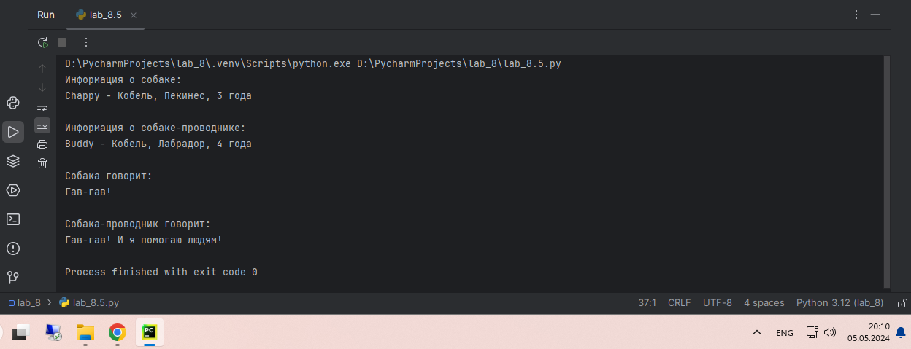

# Тема 8. Введение в ООП
Отчет по Теме #8 выполнил:
- Каленюк Дмитрий Валерьевич
- ИНО ОЗБ ПОАС-22-2

| Задание    | Сам_раб |
|------------|---------|
| Задание 1  | +       |
| Задание 2  | +       |
| Задание 3  | +       |
| Задание 4  | +       |
| Задание 5  | +       |

знак "+" - задание выполнено; знак "-" - задание не выполнено;

Работу проверили:
- к.э.н., доцент Панов М.А.

## Самостоятельная работа №1
### Самостоятельно создайте класс и его объект. Они должны отличаться, от тех, что указаны в теоретическом материале (методичке) и лабораторных заданиях. Результатом выполнения задания будет листинг кода и получившийся вывод консоли

```python
class Dog:
    def __init__(self, Имя, Порода, Пол):
        self.name = Имя
        self.breed = Порода
        self.gender = Пол

Chappy = Dog("Chappy", "Пекинес", "Кобель")

print(f"Имя собаки: {Chappy.name}")
print(f"Порода: {Chappy.breed}")
print(f"Пол: {Chappy.gender}")
```
### Результат


## Самостоятельная работа №2
### Самостоятельно создайте атрибуты и методы для ранее созданного класса. Они должны отличаться, от тех, что указаны в теоретическом материале (методичке) и лабораторных заданиях. Результатом выполнения задания будет листинг кода и получившийся вывод консоли.

```python
class Dog:
    def __init__(self, Имя, Порода, Пол, Возраст):
        self.name = Имя
        self.breed = Порода
        self.gender = Пол
        self.age = Возраст

    def describe(self):
        return f"{self.name} - {self.gender} {self.breed}, {self.age} года"

Chappy = Dog("Chappy", "Пекинес", "Кобель", 3)

print("Информация о собаке:")
print(Chappy.describe())

```
### Результат


## Самостоятельная работа №3
### Самостоятельно реализуйте наследование, продолжая работать с ранее созданным классом. Оно должно отличаться, от того, что указано в теоретическом материале (методичке) и лабораторных заданиях. Результатом выполнения задания будет листинг кода и получившийся вывод консоли.


```python
class Dog:
    def __init__(self, Имя, Порода, Пол, Возраст):
        self.name = Имя
        self.breed = Порода
        self.gender = Пол
        self.age = Возраст

    def describe(self):
        return f"{self.name} - {self.gender}, {self.breed}, {self.age} года"

Chappy = Dog("Chappy", "Пекинес", "Кобель", 3)

print("Информация о собаке:")
print(Chappy.describe())
class GuideDog(Dog):
    def __init__(self, Имя, Порода, Пол, Возраст, Обучен=True):
        super().__init__(Имя, Порода, Пол, Возраст)
        self.trained = Обучен

    def guide(self):
        if self.trained:
            return f"{self.name} помогает ведомому."
        else:
            return f"{self.name} еще не обучен."

Buddy = GuideDog("Buddy", "Лабрадор", "Кобель", 4)

print("\nИнформация о собаке-проводнике:")
print(Buddy.describe())

print(Buddy.guide())
```
### Результат


## Самостоятельная работа №4
### Самостоятельно реализуйте инкапсуляцию, продолжая работать с ранее созданным классом. Она должна отличаться, от того, что указана в теоретическом материале (методичке) и лабораторных заданиях. Результатом выполнения задания будет листинг кода и получившийся вывод консоли.

```python
class Dog:
    def __init__(self, Имя, Порода, Пол, Возраст):
        self._name = Имя
        self._breed = Порода
        self._gender = Пол
        self._age = Возраст

    def describe(self):
        return f"{self._name} - {self._gender}, {self._breed}, {self._age} года"

    def get_name(self):
        return self._name

    def get_breed(self):
        return self._breed

    def get_gender(self):
        return self._gender

    def get_age(self):
        return self._age

class GuideDog(Dog):
    def __init__(self, Имя, Порода, Пол, Возраст, Обучен=True):
        super().__init__(Имя, Порода, Пол, Возраст)
        self._trained = Обучен

    def guide(self):
        if self._trained:
            return f"{self.get_name()} помогает ведомому."
        else:
            return f"{self.get_name()} еще не обучен."

Chappy = Dog("Chappy", "Пекинес", "Кобель", 3)

print("Информация о собаке:")
print(Chappy.describe())

Buddy = GuideDog("Buddy", "Лабрадор", "Кобель", 4)

print("\nИнформация о собаке-проводнике:")
print(Buddy.describe())

print(Buddy.guide())
```
### Результат


## Самостоятельная работа №5
### Самостоятельно реализуйте полиморфизм. Он должен отличаться, от того, что указан в теоретическом материале (методичке) и лабораторных заданиях. Результатом выполнения задания будет листинг кода и получившийся вывод консоли.

```python
class Dog:
    def __init__(self, Имя, Порода, Пол, Возраст):
        self._name = Имя
        self._breed = Порода
        self._gender = Пол
        self._age = Возраст

    def describe(self):
        return f"{self._name} - {self._gender}, {self._breed}, {self._age} года"

    def speak(self):
        return "Гав-гав!"

class GuideDog(Dog):
    def __init__(self, Имя, Порода, Пол, Возраст, Обучен=True):
        super().__init__(Имя, Порода, Пол, Возраст)
        self._trained = Обучен

    def guide(self):
        if self._trained:
            return f"{self._name} помогает ведомому."
        else:
            return f"{self._name} еще не обучен."

    def speak(self):
        return "Гав-гав! И я помогаю людям!"

Chappy = Dog("Chappy", "Пекинес", "Кобель", 3)

Buddy = GuideDog("Buddy", "Лабрадор", "Кобель", 4)

print("Информация о собаке:")
print(Chappy.describe())

print("\nИнформация о собаке-проводнике:")
print(Buddy.describe())

print("\nСобака говорит:")
print(Chappy.speak())

print("\nСобака-проводник говорит:")
print(Buddy.speak())
```

### Результат

